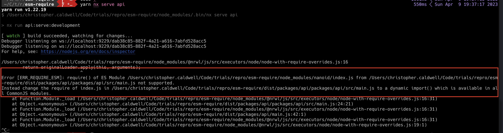
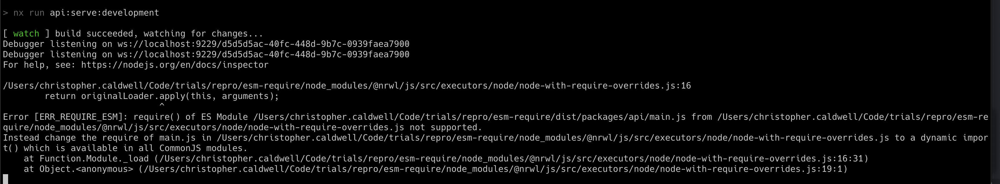

# ESM Require Repro

This is an example of ES Modules not working with the default setup. I have imported [nanoid](https://github.com/ai/nanoid#readme) (`import { nanoid } from 'nanoid'`, see [here](./packages/api/src/main.ts)) which is ESM only.

## What I have done
1. `npx create-nx-workspace esm-require --preset=ts --package-manager=yarn`
2. `yarn add -D @nrwl/node`
3. `yarn nx g @nrwl/node:app api --tags=type:app --e2eTestRunner=none`
4. `yarn add nanoid`
5. Set the format to `esm` in the project.json
6. `yarn nx serve api`

## Your repro steps

1. Clone
2. Install deps `yarn`
3. Start the API with `yarn nx serve api`
4. Observe the ESM Require error

## Resulting Error

With the `format` set to cjs (which is the default)

With the `format` set to esm

